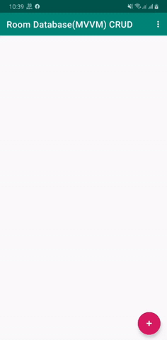
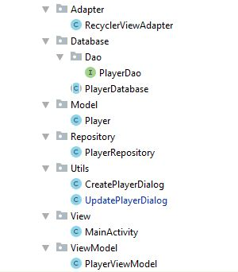

# RoomDatabase-MVVM-CRUD
This is a android app practice project. I have implemented here android MVVM architecture pattern using Room Database.

## Used Component
-RecyclerView And CardView  
-Room Database  
-AndroidX  
-ViewModel and LiveData  
-Used language Java

## App overview 

## Project Structure 

## Reference Link
https://www.youtube.com/playlist?list=PLrnPJCHvNZuDihTpkRs6SpZhqgBqPU118
